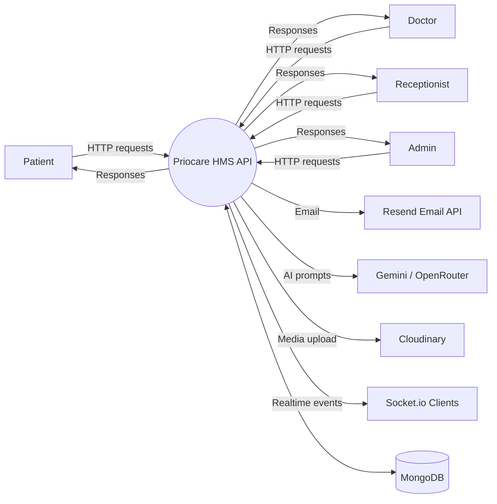
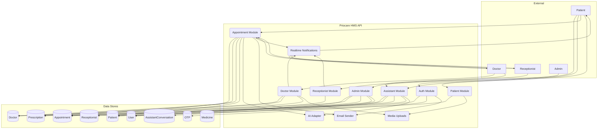
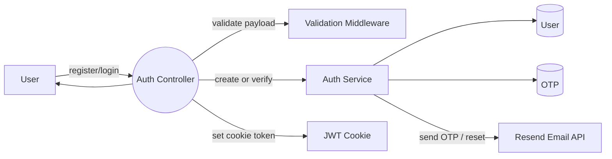
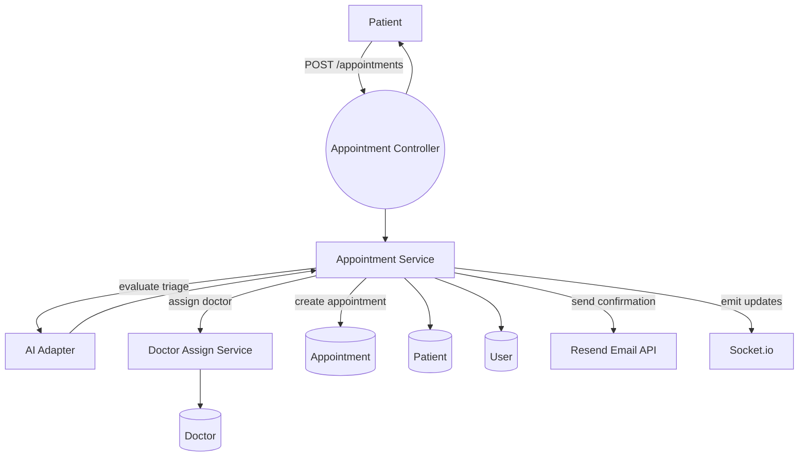
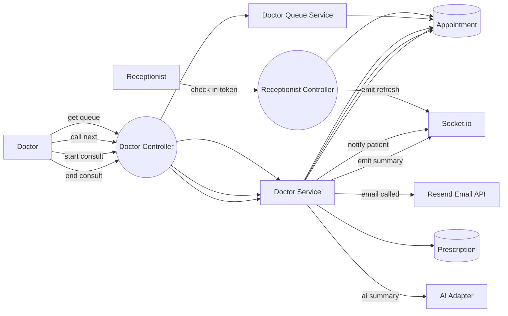
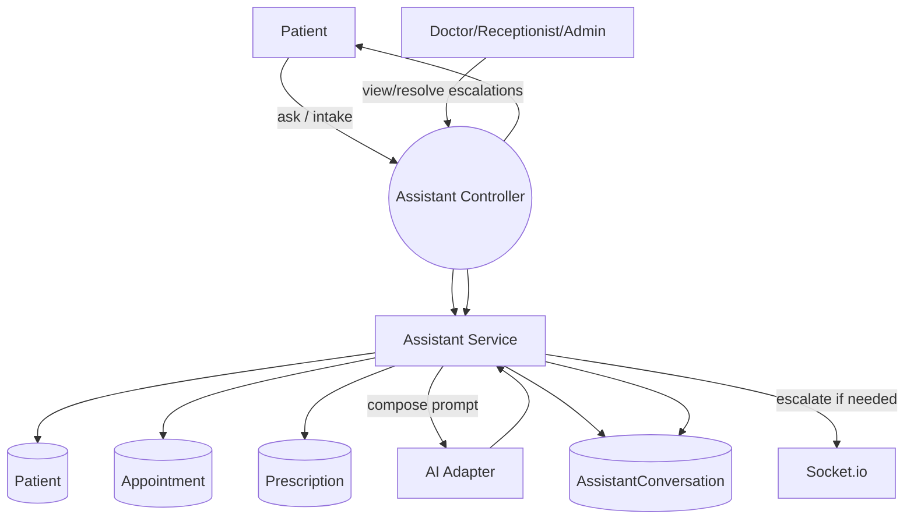
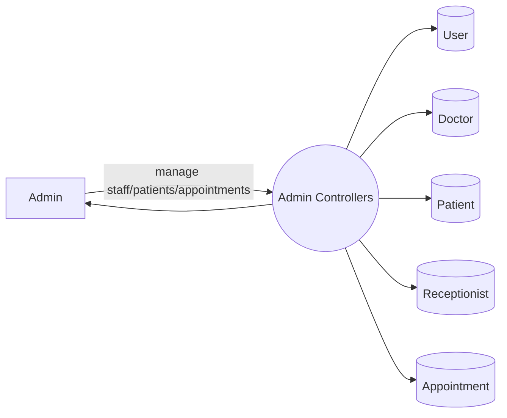

# Priocare HMS - Flows and DFDs (All Levels)

This document captures system flows and data flow diagrams (DFDs) derived from the current backend codebase. It uses Mermaid flowcharts to represent DFDs at multiple levels.

## Level 0 - Context DFD

## Level 1 - Core Modules DFD

## Level 2 - Auth Flow DFD

## Level 2 - Appointment Creation (Patient) DFD

## Level 2 - Appointment Lifecycle (Receptionist and Doctor) DFD

## Level 2 - Assistant Chat and Escalation DFD

## Level 2 - Admin Management DFD

## Notes on Cross-Cutting Concerns

- Auth: JWT cookies set on login/register; role checks via `restrictTo` middleware.
- Validation: Joi-based `validateInput` middleware gates payloads.
- Media: Profile photo uploads via `multer` to Cloudinary.
- Realtime: Socket.io rooms by role and user id; emits refresh and AI summary updates.
- AI: Gemini primary with OpenRouter fallback; used for triage, summaries, assistant.
- Email: Resend sends OTP, password reset, and appointment notifications.
